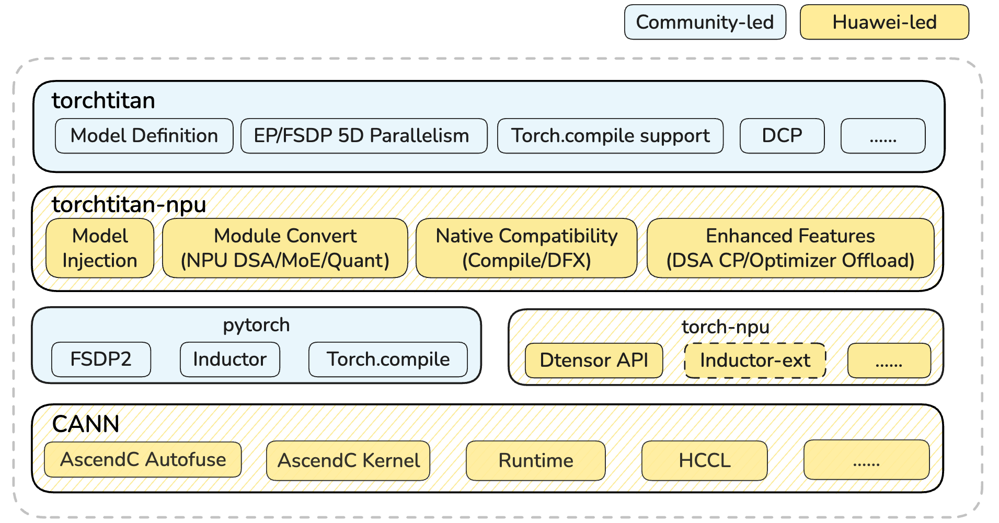

<div align="center">

# torchtitan-npu

<h4>基于 torchtitan 的昇腾全流程大模型训练适配插件</h4>

<a href="#特性支持概览"></a>
<a href="https://gitcode.com/cann/torchtitan-npu/blob/master/LICENSE"></a>
<a href="https://gitcode.com/cann/torchtitan-npu/blob/master/CONTRIBUTING.md"></a>
<a href="https://gitcode.com/cann/community/tree/master/CANN/sigs/framework-adapter"></a>
<a href="https://pypi.org/project/torchtitan-npu/"></a>
<a href="https://zread.ai/hicann/torchtitan-npu"></a>

</div>

# 简介

---

`torchtitan-npu`定位为`torchtitan`的昇腾（Ascend）后端扩展插件，通过即插即用的硬件亲和性优化，充分释放NPU算力，助力`PyTorch native`训练在昇腾平台无缝、高效、稳定地运行。

本插件基于社区 `ModelConverter` 拓展机制构建，已支持多维度训练优化，涵盖 NPU融合算子、图优化、图下沉、**算子自动融合**、显存管理、分布式并行以及调试维测能力等等。

## 社群
[](https://gitcode.com/cann/community/tree/master/CANN/sigs/framework-adapter)

SIG 例会：[sig-framework-adapter](https://meeting.osinfra.cn/cann?sig=sig-framework-adapter)

# 最新消息

---

- [Apr. 2026]: 🚀 **[DeepSeek-V4-Flash 续训练 0day 支持](https://gitcode.com/cann/cann-recipes-train/blob/master/llm_pretrain/deepseekv4/README.md)**:基于纯FSDP + 大EP极简切分，使能AutoFuse特性，达成训练入图，开箱即优。
- [Apr. 2026]: 🚀 **【重要特性支持】算子自动融合**:基于AscendC AutoFuse的能力，支持torch.compile + Inductor后端的算子自动融合。
- [Apr. 2026]: 🚀 **torchtitan‑npu 正式开源**:在 NPU 上支持 4D 并行等 torchtitan 原生特性，并引入 Swap Optimizer 等 NPU 亲和优化。

***
* [TorchTitan-NPU 0day支持DeepSeekV4续训练，助力训练场景轻松入图，开箱即优](https://gitcode.com/cann/cann-recipes-train/blob/master/docs/llm_pretrain/deepseek-v4_torchtitan_npu_autofuse.md)

# Roadmap

---

当前季度的规划见 `torchtitan-npu` [Roadmap](https://gitcode.com/cann/torchtitan-npu/issues/5)。欢迎访问。

# 安装

源码安装：

```shell
git clone https://gitcode.com/cann/torchtitan-npu.git
cd torchtitan-npu
pip install -e .
```

详情参见 [安装教程](https://gitcode.com/cann/torchtitan-npu/blob/master/docs/user-guides/installation.md) 。


# 快速上手
快速启动大语言模型的训练任务，参见
[快速上手文档](https://gitcode.com/cann/torchtitan-npu/blob/master/docs/user-guides/quickstart.md) 。

云开发平台（2 die）单机最小可运行样例，参见
[云平台开发指南](https://gitcode.com/cann/torchtitan-npu/blob/master/docs/user-guides/cloud_platform_development_guide.md) 。


# 特性支持概览

---

<table>
  <thead>
    <tr>
      <th>场景</th>
      <th>特性名称</th>
      <th>原生支持</th>
      <th>NPU支持</th>
    </tr>
  </thead>
  <tbody>
    <!-- 并行能力 -->
    <tr>
      <td rowspan="3">并行能力</td>
      <td>4D 并行 (FSDP2/TP/CP/PP)</td>
      <td>✅</td>
      <td>✅</td>
    </tr>
    <tr>
      <td>专家并行 (EP/ETP)</td>
      <td>✅</td>
      <td>✅</td>
    </tr>
    <tr>
      <td><a href="https://gitcode.com/cann/torchtitan-npu/blob/master/docs/feature_guides/parallelism/custom_cp.md">自定义 CP (DeepSeek V3.2 CP/SDPA Ulysses CP)</a></td>
      <td>❌</td>
      <td>✅</td>
    </tr>
    <!-- torch.compile -->
    <tr>
      <td>torch.compile</td>
      <td><a href="https://gitcode.com/cann/torchtitan-npu/blob/master/docs/feature_guides/torch_compile.md">torch.compile</a></td>
      <td>✅</td>
      <td>✅</td>
    </tr>
    <!-- 训练精度 -->
    <tr>
      <td rowspan="2">训练精度</td>
      <td>MxFP8 量化</td>
      <td>✅</td>
      <td>✅ (Ascend 950)</td>
    </tr>
    <tr>
      <td><a href="https://gitcode.com/cann/torchtitan-npu/blob/master/docs/feature_guides/low_precision_training.md">HiF8 量化</a></td>
      <td>❌</td>
      <td>✅ (Ascend 950)</td>
    </tr>
    <!-- 训练调试与监控 -->
    <tr>
      <td rowspan="2">训练调试与监控</td>
      <td>分布式 Checkpoint</td>
      <td>✅</td>
      <td>✅</td>
    </tr>
    <tr>
      <td><a href="https://gitcode.com/cann/torchtitan-npu/blob/master/docs/feature_guides/metrics_and_debugging.md">调试工具</a></td>
      <td>✅</td>
      <td>✅</td>
    </tr>
    <!-- 性能优化 -->
    <tr>
      <td rowspan="2">性能优化</td>
      <td><a href="https://gitcode.com/cann/torchtitan-npu/blob/master/docs/feature_guides/swap_optimizer.md">Swap Optimizer</a></td>
      <td>❌</td>
      <td>✅</td>
    </tr>
    <tr>
      <td><a href="https://gitcode.com/cann/torchtitan-npu/blob/master/docs/feature_guides/npu_fused_ops.md">NPU 融合算子适配</a></td>
      <td>❌</td>
      <td>✅</td>
    </tr>
  </tbody>
</table>

# 项目结构
torchtitan-npu 充分利用了 torchtitan 提供的 ModelConverter 插件化机制。该机制介入模型定义之后、并行策略（如 TP/FSDP）应用之前，支持以非侵入式的方式，通过注册机制对特定模块进行替换或重写。基于此方案，我们实现了融合算子优化、量化支持以及优化器增强等功能。见以下项目结构：
```
torchtitan-npu/
├── torchtitan_npu/     # torchtitan_npu核心源代码
│   ├── config/         # 对Config的补丁
│   ├── converters/     # 基于torchtitan ModelConverter机制的补丁
│   ├── distributed/    # 自定义分布式代码
│   ├── models/         # 基于torchtitan-npu的模型 (如Deepseek-V3.2)
│   ├── patches/        # 其他补丁
│   ├── tools/          # 工具补丁
│   ├── entry.py        # 启动训练
│   ├── train.py        # 训练主流程补丁
│   └── __init__.py     # torchtitan-npu 插件修改注入点
├── docs/               # 文档

```
上下游软件栈架构图如下:

# 性能基准

---

### 2026.04

System: Atlas 800T A3
| Model              | Number of NPUs | Precision | GBS | Local BS | Sequence Length | FSDP | TP  | PP  | CP  | EP  | Throughput (tokens/p/s) | MFU |
| :----------------- | :------------- | :-------- | :-- | :------- | :-------------- | :--- | :-- | :-- | :-- | :-- | :----------- | :-- |
| [DeepSeek-V4-Flash](https://gitcode.com/cann/torchtitan-npu/blob/master/torchtitan_npu/models/deepseek_v4/train_configs/deepseek_v4_285b_43layers_4k_128die.toml) | 64             | BF16      | 1024  | 1       | 4096            | 128   | 1   | 1   | 1   | 128  | 1100          | 28.78% |
| [DeepSeek-V3.2-671B](https://gitcode.com/cann/torchtitan-npu/blob/master/torchtitan_npu/models/deepseek_v32/train_configs/deepseek_v32_671b_61layers_32k_128die.toml) | 64             | BF16      | 128  | 1       | 32768           | 4    | 4   | 1   | 8  | 64  | 103           | / |
| [DeepSeek-V3.2-671B](https://gitcode.com/cann/torchtitan-npu/blob/master/torchtitan_npu/models/deepseek_v32/train_configs/deepseek_v32_671b_61layers_4k_128die.toml) | 64             | BF16      | 512  | 1        | 4096            | 32   | 4   | 1   | 1   | 64  | 146           | / |
| [DeepSeek-V3-671B](https://gitcode.com/cann/torchtitan-npu/blob/master/torchtitan_npu/models/deepseek_v3/train_configs/deepseek_v3_671b_61layers_4k_128die.toml)   | 64             | BF16      | 1024 | 1       | 4096            | 32   | 4   | 1   | 1   | 128  | 546          | / |
| [DeepSeek-V3-671B + compile(Autofuse)](https://gitcode.com/cann/torchtitan-npu/blob/master/torchtitan_npu/models/deepseek_v3/train_configs/deepseek_v3_671b_61layers_4k_128die.toml)   | 64             | BF16      | 1024 | 1       | 4096            | 32   | 4   | 1   | 1   | 128  |     576      | / |
 > 注：以上MoE模型的性能数据均开启负载均衡配置moe_force_load_balance=true。

# 免责声明

---

## 致 torchtitan‑npu 使用者

1. torchtitan‑npu 提供的所有内容仅供您用于非商业目的。
2. 对于 torchtitan‑npu 测试用例以及示例文件中所涉及的各模型和数据集，平台仅用于功能测试，华为不提供任何模型权重和数据集。如您使用这些数据进行训练，请您特别注意应遵守对应模型和数据集的 License，如您因使用这些模型和数据集而产生侵权纠纷，华为不承担任何责任。
3. 如您在使用 torchtitan‑npu 过程中，发现任何问题（包括但不限于功能问题、合规问题），请在 GitCode 提交 issue，我们将及时审视并解决。

torchtitan‑npu 功能依赖的 PyTorch 等第三方开源软件，均由第三方社区提供和维护，因第三方开源软件导致的问题的修复依赖相关社区的贡献和反馈。您应理解，torchtitan‑npu 仓库不保证对第三方开源软件本身的问题进行修复，也不保证会测试、纠正所有第三方开源软件的漏洞和错误。


# License 声明

---

- torchtitan‑npu 产品的使用许可证，具体请参见 [LICENSE](https://gitcode.com/cann/torchtitan-npu/blob/master/LICENSE)。
- torchtitan‑npu 工具 docs 目录下的文档适用相应许可证，具体请根目录下的 LICENSE 文件。

## 🤝联系我们

本项目功能和文档正在持续更新和完善中，欢迎您关注最新版本。

- **问题反馈**：通过GitCode[【Issues】](https://gitcode.com/cann/torchtitan-npu/issues)提交问题。
- **社区互动**：通过GitCode[【讨论】](https://gitcode.com/cann/torchtitan-npu/discussions)参与交流。
- **经验分享**：通过GitCode[【Wiki】](https://gitcode.com/cann/torchtitan-npu/wiki)分享经验总结。
- **加入交流群**：通过扫描下方微信二维码添加torchtitan‑npu小助手微信，加入微信群与我们进一步交流。

