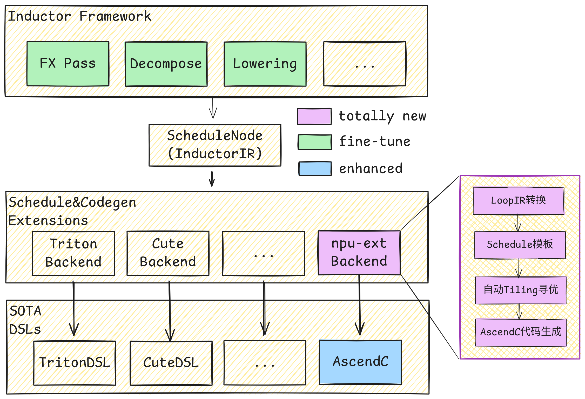

# torch.compile 支持
torch.compile 是 PyTorch 2.0 的核心特性。通过 JIT （即时编译），将 PyTorch 代码转化为高度优化的融合算子，在几乎不改动原有代码的前提下显著提升性能。作为 PyTorch 原生的分布式训练框架，torchtitan 的一大优势便是可以便捷、充分地发挥 torch.compile 的性能收益。在此基础上，torchtitan_npu 结合 CANN 生态的编译能力，在 NPU 平台上的分布式训练任务中为 torch.compile 提供支持。

## NPU 上的 torch.compile

在 torch.compile 的工作流程中，PyTorch 代码依次经过 Dynamo 成图， Inductor 图编译优化、Codegen，生成在硬件 runtime 上执行的优化 DSL 代码。

<p align="center">

</p>

为了在 NPU 平台上充分利用 `torch.compile` 原生的编译能力，`torchtitan_npu` 在保留 Dynamo 与 Inductor 既有编译流程的基础上，接入了 Codegen 后端 [`inductor-npu-ext`](https://gitcode.com/Ascend/torchair/blob/master/experimental/_inductor_npu_ext/README.md)。该后端借助 [AutoFuse](https://www.hiascend.com/document/detail/zh/CANNCommunityEdition/900beta1/graph/graphguide/autofuse_1_0001.html) 的自动融合能力，从 Inductor IR 生成 AscendC 融合 Kernel。

## torch.compile 示例

inductor_npu_ext 需要从源码安装。在运行环境内执行以下命令：
```bash
git clone https://gitcode.com/Ascend/torchair.git
cd torchair/experimental/_inductor_npu_ext/
pip3 install -e ./python/
cd -
```

在训练任务的 TOML 配置文件（例如 `torchtitan_npu/models/deepseek_v3/train_configs/deepseek_v3_671b_debug.toml`，或实际启动训练时 `--job.config_file` 所指向的 TOML 配置文件）中，找到对应的 `[compile]` 节，添加以下配置以完整编译模型：

```toml
[compile]
# 启用编译
enable = true
# 编译完整模型，而不是只编译 loss 。
components = ["model", "loss"]
```

启动训练任务前，设置以下环境变量：
```bash
export TORCHINDUCTOR_SIZE_ASSERTS=0
bash run_train.sh
```

## 支持范围
torchtitan-npu 当前支持 DeepSeek-V3 模型的全流程编译。
其他模型的 Codegen 处于待调试状态，启用 torch.compile时，需要引入补丁 `npu_bypass_triton_codegen` 以跳过 Codegen 流程：
```toml
[model]
converters = [..., "npu_bypass_triton_codegen"]
```

## 注意事项

> ⚠️ **修改模型结构后，需要清理缓存重新 compile**
>
> torch.compile 会缓存编译结果。当模型结构发生变化（如修改代码、切换分支、更新算子实现等）后，旧的缓存可能导致编译失败或运行异常。请执行以下命令清理缓存：
>
> ```bash
> rm -rf /root/.cache
> rm -rf /tmp/*
> rm -rf ./torchinductor_root
> rm -rf ./torch_compile_debug
> rm -rf .npu_kernels_root
> ```
