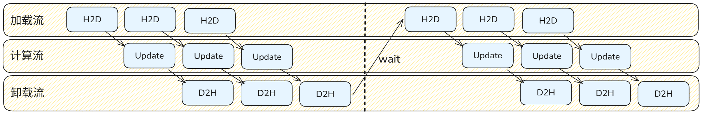

# SwapOptimizer 特性

在大规模语言模型的分布式训练中，随着模型参数量的剧增，设备内存瓶颈日益凸显。除了模型权重和激活值，优化器状态（如 Adam/AdamW 的动量和方差）通常会占用极大的显存空间。现有的常规训练方案在处理优化器状态时暴露出以下局限性：
1. 优化器状态在整个前向和反向传播过程中静态驻留在设备显存中，但实际上仅在最后的参数更新阶段才会被使用，造成了计算过程中的显存严重浪费。
2. 传统的单纯卸载（Offload）方案通常会引入巨大的 CPU 与加速卡之间的传输延迟，阻塞主计算流，导致训练吞吐量大幅下降。

## 实现原理

参考[MindSpeed框架设计的SwapOptimizer特性](https://gitcode.com/Ascend/MindSpeed/blob/master/docs/features/swap-optimizer.md)，我们在 `torchtitan` 框架的优化器构建逻辑中引入了自定义的 `SwapOptimizersContainer`，对原生的 `Adam` 和 `AdamW` 优化器的 `step` 方法进行了无缝拦截与替换，从而使能了优化器状态的动态显存管理。相关代码定义在`torchtitan_npu/patches/optimizer/swap_optimizer.py`。

本特性主要遵循“按块加载 -> 异步更新 -> 及时卸载”的流水线机制，在确保训练精度的前提下，用多流通算重叠换取巨大的显存空间收益。具体拆解如下：

### 状态初始化与零显存占位

在初始化阶段，系统会在host内存中为每个参数分配固定内存（`pin_memory=True`）以存放一阶动量 `exp_avg`、二阶动量 `exp_avg_sq` 等状态。而在device端，通过底层接口 `untyped_storage().resize_(0)` 巧妙地将这些状态的底层物理显存清空，仅保留 Tensor 的元数据。这使得在耗时较长的前向和反向传播期间，优化器状态完全不占用宝贵的设备显存。

### 异步多流通信与流水线更新

重写后的 `swap_optimizer_step` 引入了两个独立的底层数据流 `swap_to_device_stream` 和 `swap_to_host_stream`，并且将整个参数更新过程切分为多个小块（通过 `swap_optimizer_times` 控制单次处理的容量阈值 `swap_numel`）以实现高效的流水线更新：

<p align="center">

</p>

1. **Load（加载）**：在设备流中异步将下一块所需参数的优化器状态从 CPU 拷贝到 Device，并恢复其显存大小。
2. **Update（更新）**：主计算流通过事件（Event）阻塞等待状态加载完成，随后立即调用底层 Fused 算子进行参数更新。
3. **Offload（卸载）**：更新完成后，记录事件，并在主机流中将更新后的最新状态异步写回 CPU，同时再次清空设备侧显存以复用给下一个参数块。

## 配置选项

在训练任务的 TOML 配置文件（例如 `torchtitan_npu/models/deepseek_v32/train_configs/deepseek_v32_671b_debug.toml`，或实际启动训练时 `--job.config_file` 所指向的路径）中，找到对应的 `[optimizer]` 节，并添加以下配置以启用 Swap Optimizer：

| 配置项 | 类型 | 默认值 | 说明 |
| --- | --- | --- | --- |
| `name` | str | "AdamW" | 使用的优化器类型。当前 Swap 特性拦截并支持 `Adam` 和 `AdamW`。 |
| `swap_optimizer` | bool | false | 是否启用 Swap Optimizer 特性以进行显存流水线卸载。 |
| `swap_optimizer_times` | int | 16 | 切片划分次数。用于决定优化器参数卸载与加载时的分块大小。值越大，单次峰值显存占用越小，但可能增加系统的流调度开销。 |

### 配置示例
首先在配置文件中使能本代码仓的自定义配置，随后在 `[optimizer]` 节中添加以下配置，为AdamW优化器开启SwapOptimizer特性并设置流水线切片参数：

```toml
[job]
custom_config_module = "torchtitan_npu.config.custom_config"    # 使能本代码仓的自定义配置

[optimizer]
name = "AdamW"
lr = 3e-4
weight_decay = 0.01
swap_optimizer = true       # 启用 Swap Optimizer
swap_optimizer_times = 16   # 设置流水切分次数
```